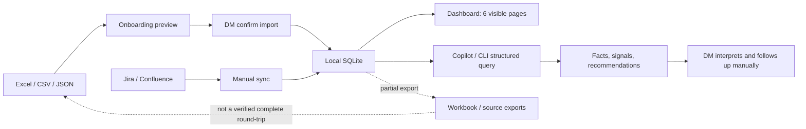
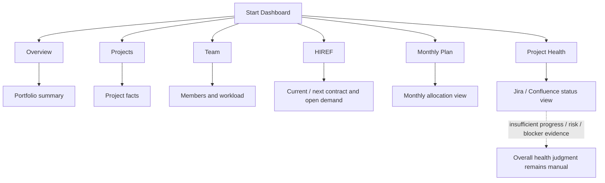
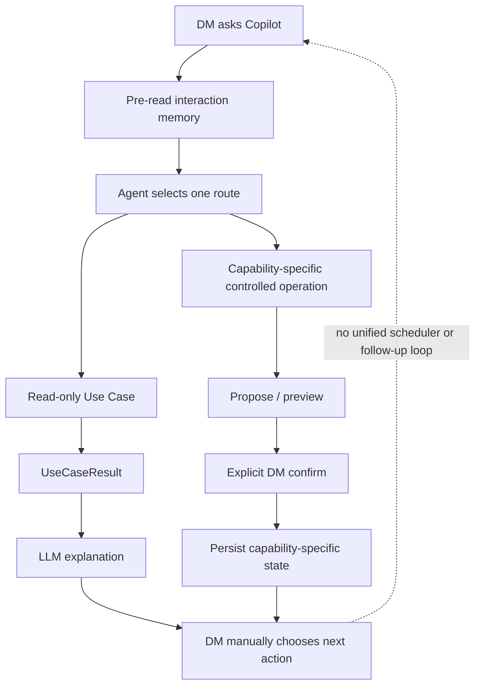
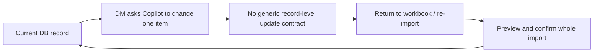
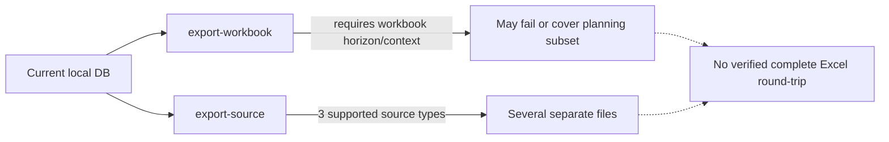
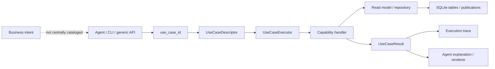
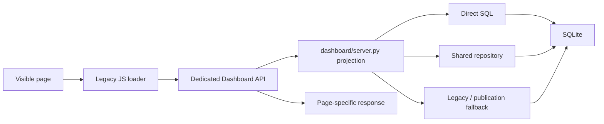
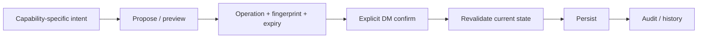
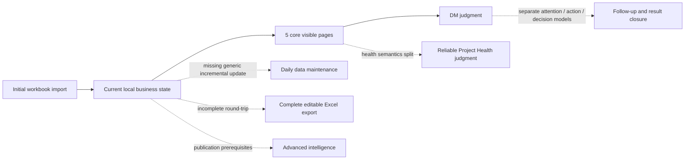

# Current Workflow Map

审计日期：2026-08-11

范围：当前代码中的用户入口、前置数据、输出和断点；不包含未来方案设计。

## 1. 当前产品主路径

目前产品闭环主要结束在“DM 得到信息并自行处理”。系统内没有一条已验证路径能够继续覆盖统一确认、执行、结果跟踪和主动再次提醒。

## 2. 默认 Dashboard 路径

Owner 已实际使用 Overview、Projects、Team、HIREF、Monthly Plan，这些页面具有真实业务基础；但使用过和页面可运行不证明它们足以支持一次判断或决策。Project Health 页面可运行，但 Owner 明确认定“显示 sprint 状态”和“判断项目整体是否健康”之间仍有语义缺口。

## 3. 工作流清单

| ID | 用户目标 | 起点与步骤 | 最终结果 | 当前断点 | 证据 | 成熟度 |
|---|---|---|---|---|---|---:|
| WF-01 | 第一次建立本地数据 | workbook → profile / preview → confirm | 本地项目、人员、plan、allocation、capacity、HIREF | 后续单条更新仍不方便 | CODE / TEST / OWNER-USED | L2（DI）；操作链完整 |
| WF-02 | 快速了解当前组合 | Dashboard → Overview | 汇总 KPI 和异常摘要 | 发现后无统一处理链 | CODE / RUNTIME / OWNER-USED | L2 |
| WF-03 | 查看项目 | Dashboard → Projects | 项目清单和详情 | profile、Jira、execution 数据来源不统一 | CODE / RUNTIME / OWNER-USED | L2 |
| WF-04 | 查看团队与负荷 | Dashboard → Team | 人员和 workload | legacy allocation 与 publication 模型并存 | CODE / RUNTIME / OWNER-USED | L2 |
| WF-05 | 查看 HIREF / open demand | Dashboard → HIREF | 当前 / 后续 HIREF 与缺口 | HIREF、placeholder、demand 多种表示 | CODE / RUNTIME / OWNER-USED | L2 |
| WF-06 | 查看月度计划 | Dashboard → Monthly Plan | 月度 allocation | 随包 demo 默认选择空 plan；完整导出不稳定 | CODE / OWNER-USED；runtime 冲突 | L2 |
| WF-07 | 查看项目健康 | sync → Project Health | sprint / Jira / Confluence 状态 | 缺少足够 progress、risk、blocker 维度 | CODE / RUNTIME / OWNER-MEANING | L2 |
| WF-08 | 用 Copilot 查询 | 提问 → Agent route → structured command | facts / signals / recommendations | 用户需知道何时调用；不是主动发现 | CODE / TEST | L2 |
| WF-09 | 做 staffing 判断 | assess → propose → preview → confirm | 候选、feasibility、proposal / allocation | demo 因 publication / freshness 非 decision-ready | CODE / TEST / partial RUNTIME | L2 |
| WF-10 | 处理 attention | reconcile / query → ack / snooze preview → confirm | attention state | 默认隐藏；无通知和执行闭环 | CODE / TEST / RUNTIME | L2 |
| WF-11 | 查看 execution | import / derive → delivery execution review | milestone / release / dependency signals | 依赖 evidence pipeline；真实源未验证 | CODE / TEST / RUNTIME | L2 |
| WF-12 | 查看 layered health | reimport → derive → assess → review | 维度和 factor 结果 | 常见维度 unavailable；默认隐藏 | CODE / TEST / RUNTIME | L2 |
| WF-13 | 查看 capacity | import / publish → heatmap | capacity facts / signals | 需要单独 publication；无常用编辑入口 | CODE / TEST / RUNTIME | L2 |
| WF-14 | 生成 Weekly Brief v2 | 多能力准备 → query → optional snapshot | 分节 brief | 多个 section partial / unavailable；无主动发送 | CODE / TEST / RUNTIME | L2 |
| WF-15 | 跟进 action | action-followup query | action 列表 | action_items 与 action_tracker 并存，后续闭环不统一 | CODE / RUNTIME | L2 |
| WF-16 | 导出并迁移到新版 | database → export-workbook / export-source → re-import | 可继续维护的 Excel / source files | 尚无完整、通用、可复现 round-trip | CODE / TEST / failed RUNTIME | L1 |

Jira / Confluence 同步另有 `OWNER-REAL-DATA` 证据：Owner 确认其曾在公司环境使用真实数据运行；本次没有重新执行当前快照的 live verification。

## 4. Copilot / Agent 实际调用图

Agent 当前连接了“提问”和“结构化结果”，也连接了少数能力自己的受控操作；但它没有统一连接核心数据更新、行动执行和后续监控。

## 5. 数据进入路径

| 数据路径 | 写入对象 | 谁消费 | 现状 |
|---|---|---|---|
| 标准 workbook | members、projects、allocations、capacity、HIREF | 5 个核心页面、staffing、capacity | 最成熟的初始数据路径 |
| Project profile workbook | project profiles、risks 等 | Projects、planning、source export | 辅助路径 |
| Jira connector / board registry | issues、sprints、health、evidence | Project Health、execution、attention、brief | 代码存在；真实同步未验证 |
| Confluence connector / page registry | pages、status、actions | Project Health、action follow-up、brief | 代码存在；真实同步未验证 |
| Workforce planning JSON | publication / coverage | staffing、capacity、brief | advanced 前置路径 |
| Resource capacity JSON | observations / publication | heatmap、staffing、health、brief | advanced 前置路径 |
| Milestone JSON / source evidence | canonical execution | execution、attention、health、brief | advanced 前置路径 |
| Project Health re-import JSON | observations / assessment | layered health、brief | advanced 前置路径 |
| ServiceNow CR CSV | change requests | CR review、brief | 不在默认 UI 主路径 |

一个用户问题可能需要先完成多条数据路径。例如 Weekly Brief v2 会读取 health、execution、capacity、attention、actions 和 connector freshness；任何一条缺失都会传播为 partial / unavailable。这是当前“代码很多、结果仍不完整”的主要工作流原因之一。

## 6. 默认隐藏的产品面

默认配置把以下 7 个 tab 标记为 experimental：

- Attention
- Weekly Brief v2
- Capacity Heatmap
- Delivery Execution
- Layered Health
- Connectors
- Snapshots

它们有 HTML / JavaScript loader，部分有专用 operation API，也可以经通用 Use Case API 调用。但默认隐藏意味着：

1. 普通用户不会从主导航自然进入；
2. Owner 没有把它们作为已采用的日常能力；
3. 它们不能按“页面已存在”计为完整用户工作流。

## 7. 增量更新断点

当前核心数据维护路径是：

代码中可以找到 staffing、attention、weekly brief snapshot、health config 等“能力专属”的 propose / preview / confirm 写入，但没有找到通用的 project、employee、HIREF、monthly allocation 单条更新命令。这与 Owner 报告的实际体验一致。

## 8. 导出与升级断点

当前没有证据证明任意受支持的初始导入路径，加上后续 capability-specific 写入后，都能导出为一个完整标准 Excel 并在新版中 clean re-import。该路径是 L1。

## 9. L4 闭环检查

| L4 环节 | 当前状态 |
|---|---|
| 主动发现 | 部分 producer / reconciliation 可计算，但需要显式触发或上游流程 |
| 证据解释 | Agent 和 UseCaseResult 可以提供 facts / signals / recommendations |
| DM 确认 | staffing、attention、snapshot、config 等局部能力支持 preview / confirm |
| 执行 | 只在各 capability 内执行有限状态写入；没有统一业务执行层 |
| 后续闭环 | 未发现面向 DM 的统一定时复查、通知、结果验证和关闭流程 |

结论：各环节有零散组件，但没有一条已验证 DM 工作流完成一次端到端判断或决策，也没有流程覆盖全部五步。因此当前没有已验证的 L3/L4 DM 决策工作流。

## 10. 当前可被称为产品的最小边界

基于代码、runtime 和收紧后的 Owner 反馈，当前可确认的产品边界是：

> 通过一次受控初始导入，把项目、团队、HIREF 和 Monthly Plan 放入本地数据库，并通过 5 个核心 Dashboard 页面持续查看；Project Health 提供 Jira / Confluence 状态辅助，但整体健康判断仍由 DM 完成。

初次导入是一条完整操作型工作流；5 个核心页面和 Project Health 均属于 L2 信息 / 分析能力。当前没有已验证的 L3/L4 DM 决策工作流。

其余能力应暂时视为候选工具或分析引擎，而不是已经进入真实流程的产品承诺。本文件不提出后续实现方案，也不授权代码或数据库变更。

## 11. 当前实现追踪图

### 11.1 Structured Use Case：相对完整

从 `use_case_id` 开始，descriptor、handler、typed result 和 execution trace 都可追踪。断点在更上游：没有统一说明某个 DM 业务场景为什么应选择这个 ID，也没有证明它已进入用户的固定工作流。

### 11.2 Legacy Dashboard：承载价值但较难追踪

这条链支撑 Owner 已使用的页面，但 route 同时承担 projection、数据选择和 fallback，业务规则没有统一进入 capability contract。它应成为增量可追踪化的重点，而不是被新 UI 替代。

### 11.3 Controlled Write：局部完整

Staffing、Attention、Project Health config 和 Weekly Brief snapshot 等局部能力拥有这条链。核心 Project / Member / HIREF / Monthly Allocation 的日常更新没有接入同一模式。

## 12. 业务到发布的追踪断点

| 目标链路 | 当前状态 | 断点位置 |
|---|---|---|
| 业务场景 → Product Capability | 不完整 | 主要按页面、命令和 IP 命名，没有统一场景目录 |
| Capability → 用户工作流 | 不完整 | advanced capability 默认隐藏或需要手工前置流程 |
| Workflow → User Story / Acceptance Criteria | 较弱 | implementation pack 偏技术 AC，缺少 Owner journey AC |
| AC → UI / API / Service / Domain / Data | structured use case 较强；legacy UI 较弱 | Dashboard direct SQL / fallback 和多套数据 authority |
| Implementation → Test Evidence | 中高 | 56 个测试文件和 pack evidence；没有 repository-wide coverage threshold |
| Test Evidence → Release Result | 较弱 | transport snapshot 无 Git provenance；生成 Agent 与源码 Agent 不同 |
| Release Result → Owner adoption | 断裂 | implemented / promoted 没有记录是否进入 Owner 日常流程 |

## 13. Golden Path 断点图

对后续 Roadmap 最有用的不是再扩展右侧能力，而是判断哪些现有组件可以关闭上述虚线断点：

1. 日常增量维护；
2. 完整可编辑导出与升级 round-trip；
3. Project Health 的证据和结论边界；
4. 发现到 follow-up 的一个真实场景；
5. advanced capability 的最小可靠 prerequisite。

这些是 discovery / 排序输入，不是实施授权。
