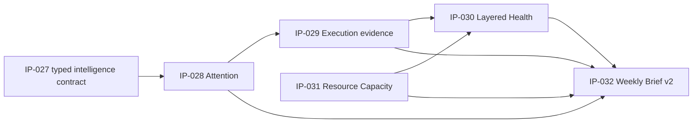

# IP-027～IP-032 Decision Matrix

审计日期：2026-08-11

决策性质：当前产品审计结论，不是删除、重构或继续实现授权。

## 1. 总体判断

IP-027～IP-032 不是“完全没有实现”。相反，它们有较多源码、schema、CLI / API / Agent 路由和自动化测试，多个 Use Case 也能在合成数据库上执行。

问题是这些 IP 主要形成了一个逐层叠加的技术能力链，而不是 Owner 已经固定采用的 DM 工作流：

后续 IP 同时依赖更多 import、publication、freshness、derivation 和 operation 表。当任一上游缺失时，下游并不会“变聪明”，而是返回 partial、unknown 或 not_available。`OWNER-REPEATED` 证据明确为：IP-027～IP-032 尚未成为 Owner 固定使用的工作流。因此不能把“promoted”“测试通过”或“有页面代码”当作产品验证；是否曾偶发使用或足以支持单次真实决策，均为 `OWNER CONFIRMATION REQUIRED`。

IP-027～IP-032 当前评级均为 L1 或 L2，不能补足整体产品的 L3。当前没有已验证的 L3/L4 DM 决策工作流。

## 2. 决策矩阵

| IP | 原始业务目标 | 代码与入口证据 | 输入与输出 | 工作流与 runtime 证据 | 主要重叠 / 成本 | 成熟度 | 当前审计决定 |
|---|---|---|---|---|---|---:|---|
| IP-027 | 建立统一的 facts / signals / recommendations 契约，使智能能力可解释、可校验 | `use_cases/service.py` 定义 `UseCaseResult`；registry 注册结构化 Use Case；Agent / API 读取统一结果 | 输入为确定性 reader 输出；输出 typed facts、signals、recommendations、warnings、evidence | 它是共享基础设施，没有独立用户目标或页面。后续多个 Use Case 使用该契约 | 与 legacy dict / summary 输出并存；无独立表，但会增加每个 Use Case 的 contract / validation 维护 | **L1** | **保留为底层契约，冻结扩张。** 不把它单独计为产品功能 |
| IP-028 | 建立 Delivery Attention Center，集中需关注事项并支持 ack / snooze | attention modules；`delivery-attention-center`、`management-attention`；CLI；`/api/attention/operations`；Agent route；隐藏 Attention tab | rules、signals、reconciliation → attention items、facts、signals、recommendations、history / operation state | demo 返回非空 attention items；ack / snooze 有 preview / confirm。默认 UI 隐藏，无主动通知；尚未成为 Owner 固定工作流 | 与 Overview 异常、health signals、actions 有语义重叠；至少 6 张 attention 表 | **L2** | **保留候选能力，冻结产品扩张。** 不能称为主动闭环；等待真实 DM case 验证 |
| IP-029 | 统一 Jira / milestone / release / dependency evidence，并提供 execution review 和 attention producer | source evidence、execution、milestone import modules；`delivery-execution-review`；Agent route；隐藏 Delivery Execution tab | staged / published evidence → canonical work items、milestones、dependencies、derivation facts / signals | demo review 可返回 facts / signals；critical overdue milestone 可成为 attention producer。真实 Jira / milestone 导入未验证 | 与 legacy Jira issues / sprints / health snapshots 并存；强相关表至少 24 张 | **L2** | **保留代码事实，冻结为未采用候选。** 不以“canonical 已建成”推断真实 execution 工作流完成 |
| IP-030 | 用多维 factor / evidence 形成 Layered Project Health，并支持受控配置 | project health assessment / config / reimport modules；`layered-project-health-review`；Agent route；隐藏 Layered Health tab | execution、health、resource 等 observations → dimension / factor states、assessment | demo 能返回 assessment，但 delivery、quality、governance、resource 等维度可为 unknown / not_available；`OWNER-MEANING` 明确可见 Project Health 缺少 progress、risk、blocker | 与 legacy `/api/project-health` 和 Jira health 概念重叠；14 张 assessment / config / reimport 表 | **L2** | **重新定性并冻结。** 现有 legacy health 不是完整项目健康；layered health 也未获真实使用验证 |
| IP-031 | 导入并发布 resource capacity，提供 heatmap，并让 staffing 可感知 capacity | resource capacity / workforce planning modules；`resource-capacity-heatmap`；staffing capacity policy；Agent route；隐藏 Capacity tab | workforce planning + capacity publications → available capacity、heatmap signals、staffing safety checks | demo heatmap 返回数据；staffing assess 有候选但 `decision_ready=false`，因为 source publication / freshness 不完整；尚未成为 Owner 固定工作流 | 与 legacy employees / assignments / monthly allocations 并存；强相关表至少 15 张，另复用多个 core 表 | **L2** | **冻结。** 在日常数据维护和来源可用性得到验证前，不把 capacity-aware staffing 视为产品承诺 |
| IP-032 | 把多个能力组合成 Weekly DM Brief v2，并可保存 snapshot | weekly brief modules；`weekly-dm-brief-v2`；query + snapshot preview / confirm；Agent route；隐藏 Weekly Brief tab | health、execution、capacity、attention、actions、connectors 等 → 9-section brief、recommendation、snapshot | demo 可生成 brief，但多个 section 为 partial / not_available；没有主动发送、action 执行或下一周期闭环；尚未成为 Owner 固定工作流 | 是依赖最广的 composer，会放大所有上游数据缺口；1 张专属 snapshot operation 表，但运行成本跨越所有上游 | **L2** | **冻结为组合实验。** 在 Owner 完成端到端周工作流验证前，不视为已形成产品能力 |

## 3. 分项证据

### 3.1 IP-027：结构化智能契约

**解决的问题**

把分析结果统一为事实、信号、建议、证据和 warning，避免 LLM 自行计算或直接读写数据库。

**入口与依赖**

- 不是用户独立入口；由通用 tool API、CLI 和 Agent 间接使用。
- 上游是各 domain reader；下游是 LLM 解释和 UI renderer。

**实际状态**

- 多个新 Use Case 已使用 typed facts / signals / recommendations。
- legacy health、team workload 等仍可返回旧式 summary 或没有 typed intelligence，契约未覆盖全部产品面。
- 它提高实现一致性，但不能单独完成 DM 判断。

**评级：L1。** 基础设施存在且有价值，但没有独立用户流程。

### 3.2 IP-028：Delivery Attention Center

**解决的问题**

集中项目、人员和执行信号，减少 DM 分散查看；对 attention item 记录 reconcile、ack、snooze 和历史。

**用户入口**

- Copilot direct route；
- CLI；
- 通用 Use Case API；
- `/api/attention/operations`；
- 默认隐藏的 Attention 页面。

**输入 / 输出**

- 输入：rules、producer signals、历史状态、freshness。
- 输出：attention items、priority、facts / signals / recommendations、ack / snooze 状态。

**上下游**

- 上游依赖 execution、health 或其他 producer 的显式执行。
- 下游可被 Weekly Brief v2 读取。

**运行证据**

- 合成 demo 中 management attention 返回 6 个 item / facts / signals。
- Delivery Attention Center 返回 8 个 item、8 facts、8 signals、8 recommendations。
- 自动化测试覆盖 reconcile 和受控 operation。

**缺口**

- 没有面向 DM 的调度或主动通知；“自动 producer”不等于“主动交付给用户”。
- ack / snooze 是 attention 状态管理，不是业务 action 的执行与结果闭环。
- 尚未成为 Owner 固定工作流；是否曾偶发使用为 `OWNER CONFIRMATION REQUIRED`。

**成本**

`attention_rules`, `attention_signals`, `attention_history`, `attention_reconciliations`, `attention_operations`, `attention_configuration_operations` 共 6 张直接相关表。

**评级：L2。** 局部查询和状态操作可用，仍需人工拼接。

### 3.3 IP-029：Execution Evidence 与 Milestone

**解决的问题**

把 Jira issue / event / link、sprint、release、milestone 和 dependency 变成可追溯的 canonical execution evidence，供 review、health、attention 和 brief 读取。

**用户入口**

- evidence / milestone import 的 preview / confirm；
- `delivery-execution-review` CLI / Agent / API；
- 默认隐藏的 Delivery Execution 页面。

**输入 / 输出**

- 输入：Jira evidence、milestone JSON、release observations、scope mappings。
- 输出：canonical work items / sprints / milestones / dependencies、derivation facts 和 signals。

**运行证据**

- 合成 demo 的 delivery execution review 返回 8 facts、3 signals。
- 测试覆盖 evidence staging / publication、derivation、review 和 attention producer。
- 真实 connector 和真实 milestone 工作流 `UNVERIFIED`。

**重叠与成本**

- legacy `jira_issues`, `jira_sprints`, `jira_health_snapshots` 继续存在。
- IP-029 强相关表至少 24 张：source evidence staging / publication 8 张、canonical execution 15 张、milestone operation 1 张；不含共享 trace。

**评级：L2。** 技术链完整度较高，但没有证据证明 DM 已在真实流程中使用。

### 3.4 IP-030：Layered Project Health

**解决的问题**

尝试把项目健康从单一 Jira sprint 状态扩展为多维 assessment，并保留 evidence、factor、dimension 和配置历史。

**用户入口**

- `layered-project-health-review`；
- Project Health config show / preview / confirm；
- project-health reimport confirm 后的 assessment；
- 默认隐藏的 Layered Health 页面。

**输入 / 输出**

- 输入：execution、delivery、quality、governance、resource 等 observation 与 factor config。
- 输出：assessment run、factor result、dimension state、facts / signals。

**运行证据**

- 合成 demo 返回 1 个 assessment、1 fact、1 signal。
- 多个维度可保持 unknown / not_available。
- `OWNER-USED`：Owner 实际使用过默认可见的 legacy Project Health；`OWNER-MEANING`：明确认为它不足以判断整体健康。

**关键区分**

默认可见的 legacy Project Health 和 IP-030 Layered Health 是两条并存能力。前者可用但语义有限；后者维度更丰富，但默认隐藏、数据前置复杂且尚未成为 Owner 固定工作流。两者不能相互证明完成。

**成本**

assessment、factor、dimension、observation、config、reimport 共 14 张直接相关表。

**评级：L2。** 可做局部 assessment，但尚未形成可信的端到端项目健康判断。

### 3.5 IP-031：Resource Capacity Intelligence

**解决的问题**

把 leave、BAU、non-project workload 和 project allocation 合成为可用 capacity，并让 staffing 决策检查 capacity safety。

**用户入口**

- workforce planning / resource capacity onboarding；
- `resource-capacity-heatmap`；
- staffing assess / propose；
- capacity policy preview / confirm；
- 默认隐藏的 Capacity Heatmap 页面。

**输入 / 输出**

- 输入：workforce planning publication、capacity observations、allocation coverage。
- 输出：available capacity、heatmap facts / signals、staffing safety blockers。

**运行证据**

- 合成 demo heatmap 返回 3 行、3 facts、3 signals。
- staffing assess 能返回候选，但不满足 decision-ready，因为 current-state staffing / contract coverage publication freshness 不完整。
- 尚未成为 Owner 固定工作流；是否曾偶发使用为 `OWNER CONFIRMATION REQUIRED`。

**成本与重叠**

- 与 `employees`, `assignments`, `plan_versions`, `monthly_allocations` 的 legacy planning 模型并存。
- workforce planning 5 张、resource capacity 7 张、staffing capacity 2 张、monthly project coverage 1 张，强相关至少 15 张。

**评级：L2。** 计算与安全门存在，但数据准备和用户路径未收束。

### 3.6 IP-032：Weekly Brief v2

**解决的问题**

把一周内的 project health、execution、capacity、attention、actions、connectors 等信息组合成 DM brief。

**用户入口**

- `weekly-dm-brief-v2` query；
- snapshot preview / confirm；
- Agent route；
- 默认隐藏的 Weekly Brief v2 页面。

**输入 / 输出**

- 输入：多个 public reader 的当前状态与 freshness。
- 输出：9 个 section、facts / signals / recommendation、可选 snapshot operation。

**运行证据**

- 合成 demo 成功返回 2 facts、8 signals、1 recommendation。
- resource concerns、decisions required 等 section 可为 not_available；其他 section 也可能 partial。
- 未发现自动发布、邮件 / Teams 通知、action 写入或跨周结果验证。
- 尚未成为 Owner 固定工作流；是否曾偶发使用为 `OWNER CONFIRMATION REQUIRED`。

**成本**

专属持久化只有 `weekly_brief_snapshot_operations`，但实际维护成本来自对所有上游 contract、freshness 和降级状态的组合。

**评级：L2。** 作为按需汇总器可运行，作为 DM 周工作流尚未完成。

## 4. 文档声明与实际状态

| 维度 | 文档 / 状态文件可能表达 | 本次代码与用户证据 |
|---|---|---|
| Implementation | phase / batch 已实现、测试、promoted | 多数成立于代码和测试层 |
| User entry | 有 CLI、Agent route、API 或页面 | 多数存在，但 7 个页面默认隐藏 |
| Data readiness | demo / import 能提供输入 | 不同 publication 可缺失；随包 demo 有组合不一致 |
| Real DM adoption | 未被实现报告证明 | Owner 明确 IP-027～IP-032 尚未成为固定工作流；其他采用程度需确认 |
| End-to-end usefulness | 常由能力名称或测试推断 | 多数仍需人工串接；没有 L4 闭环 |

所以 IP 状态应拆成四句话，而不能只说“完成”：

1. 代码是否存在：多数是；
2. 测试是否覆盖：多数是；
3. 合成数据能否局部运行：多数是；
4. 是否成为 Owner 的固定工作流：否；是否曾单次支持实际决策为 `OWNER CONFIRMATION REQUIRED`。

## 5. 当前冻结边界

本次审计只做如下产品判断：

- IP-027 的统一输出契约可视为基础设施；
- IP-028～IP-032 可视为保留在代码中的候选能力；
- 这些能力目前不应继续按“已完成产品功能”累计；
- 不因本矩阵自动删除页面、API、Service、Agent、Job 或表；
- 不因本矩阵自动提出替代架构或数据库 redesign；
- 下一步必须由 Owner 对本审计结论确认后另行决定。

完成本矩阵后，当前 gate 停止。

## 6. 增量演进与资产复用矩阵

| IP | 应保留的资产 | 最接近真实价值的连接点 | 当前不应做的事 | 何时才有重构理由 |
|---|---|---|---|---|
| IP-027 | typed fact / signal / recommendation、descriptor、executor、trace | 让已有用户工作流复用同一结果合同 | 新建第二套 intelligence contract；为了统一而改写所有 legacy response | 某个 Golden Path 接入时，现有 contract 确实无法表达其证据或状态 |
| IP-028 | rules、stable attention identity、history、ack / snooze controlled operation | 在现有核心页面或一个固定 DM review 中消费少量已可靠 signal | 继续新增 attention producer、页面或 lifecycle 状态 | 一个真实 follow-up 场景证明当前 service 边界阻碍测试或修改 |
| IP-029 | evidence staging / publication、canonical milestone / dependency、review reader | 把一个真实项目执行判断连接到 Projects / Project Health / brief | 继续增加新的 execution object 或 source schema | 真实 connector journey 证明 legacy / canonical 双路径无法安全维护 |
| IP-030 | evidence、factor / dimension result、unknown / unavailable 语义、受控配置 | 收束默认 Project Health 的事实和判断边界 | 新建第三套 health engine；只因维度不完整就重写 assessment | Owner 批准的 health AC 无法由现有 evidence / factor contract表达 |
| IP-031 | versioned capacity import、publication、heatmap、staffing safety blocker | 让一个明确 staffing case 使用可靠的 current plan / capacity | 扩大 policy、预测或自动排班范围 | 数据 authority 和 onboarding 已稳定，但现有模型仍无法支撑该 case |
| IP-032 | composer、section degradation、snapshot preview / confirm | 固定一个受限的 weekly review，优先组合当前可靠数据 | 增加 section、渠道或自动执行；把 unavailable 包装成结论 | 真实 weekly workflow 证明 composer dependency 或 section owner 无法维护 |

## 7. 对交接和 TPO 决策的含义

IP-027～IP-032 的后续状态不应再只用“implemented / promoted”表示。至少需要分别记录：

1. 代码和 schema 是否存在；
2. 是否有可达的默认用户入口；
3. 上游数据是否能由普通 operator 准备；
4. 是否有一个 Owner 批准的业务场景和 acceptance criteria；
5. 是否通过该场景的 end-to-end journey test；
6. 是否实际进入 Owner / DM 的重复工作流；
7. 哪个 release artifact 包含并验证了它。

TPO 后续可以按业务价值决定某个 IP 是继续连接、保持冻结还是最终退役；开发人员负责提供调用链、影响范围、测试和 release evidence。当前审计不对任何 IP 授权删除或继续实现。
